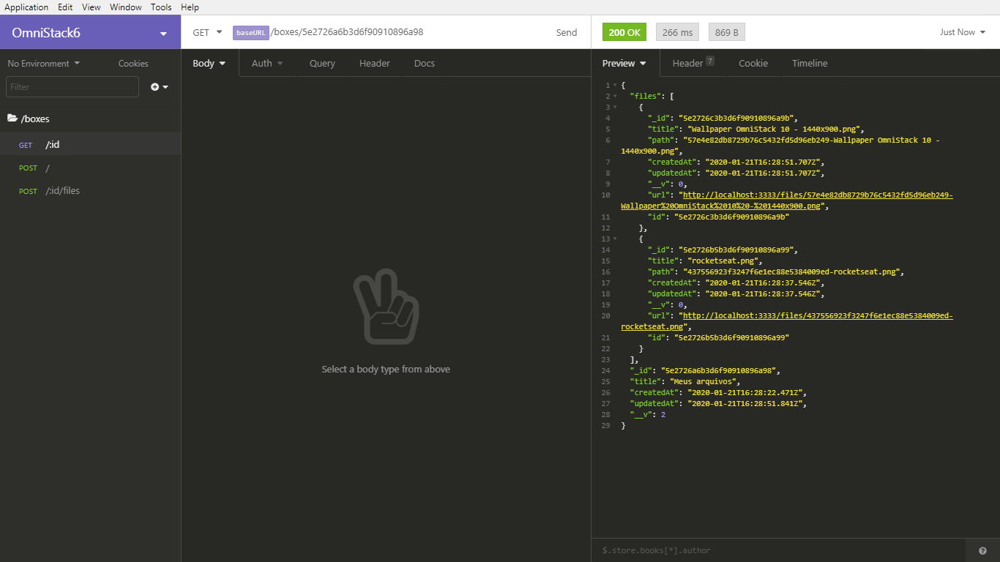
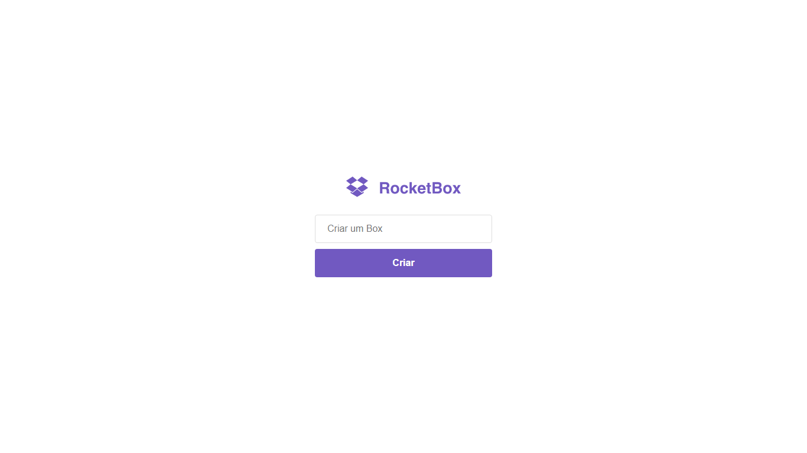
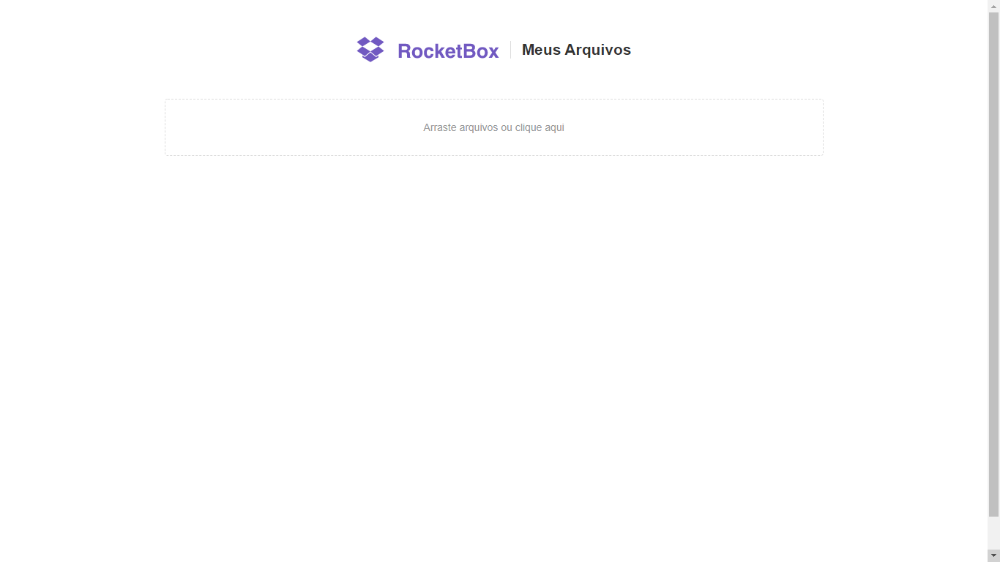
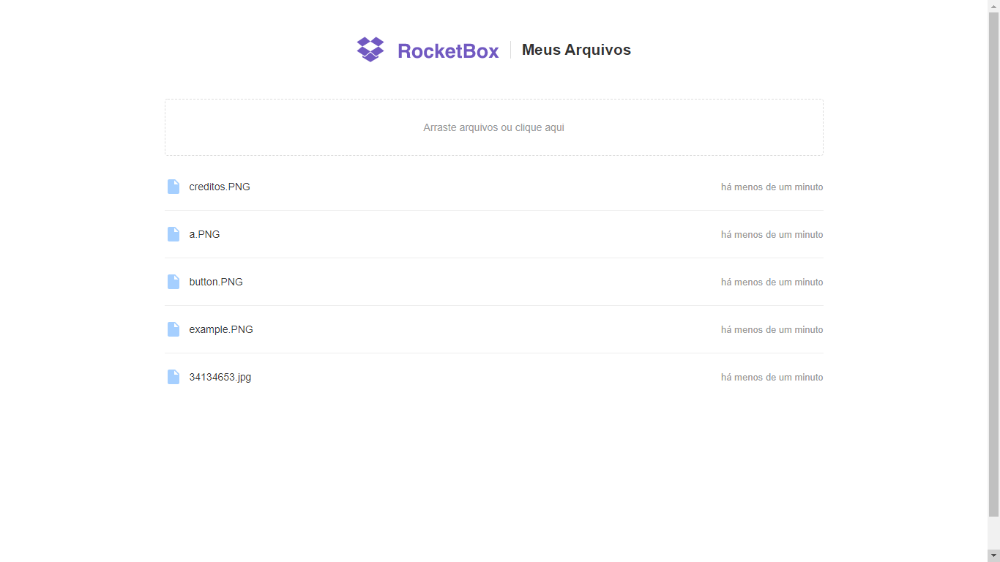
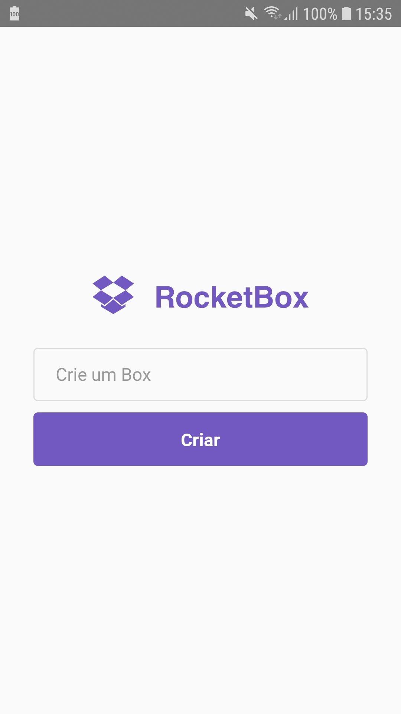
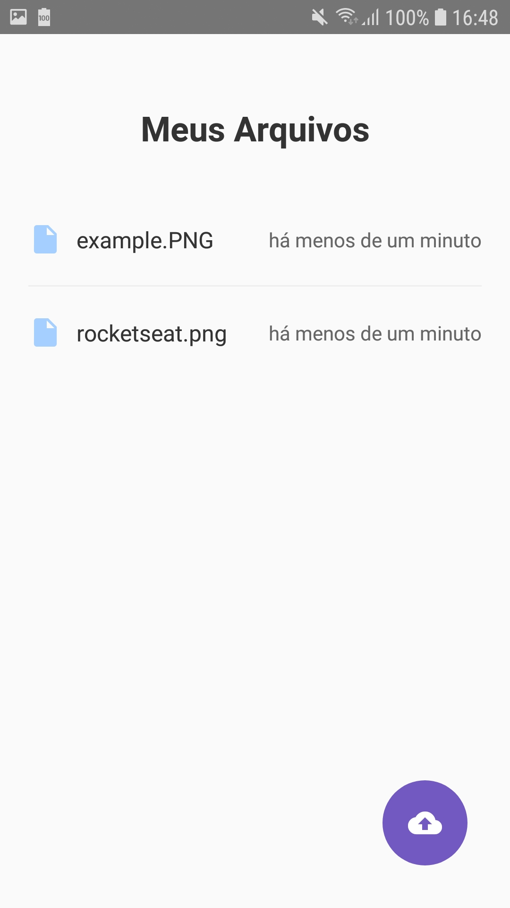

<h1 align="center">Semana Omnistack 6</h1>

Projeto desenvolvido na semana OmniStack 6.0 da Rocketseat.

## Sobre o projeto

A ideia do projeto é criar um aplicativo semelhante ao do Dropbox, usando a stack Node.js, ReactJS e React Native.

## Funcionalidades

- Criar uma Box
- Adicionar imagens a uma Box
- Listar as imagens de uma Box
- Adicionar múltiplas imagens e em tempo real

## Backend

Para executar o backend siga as instruções do arquivo [README.md](https://github.com/DouglasVarollo/OmniStack6/blob/master/backend/README.md) que está na pasta backend.

  

## Frontend

Para executar o frontend siga as instruções do arquivo [README.md](https://github.com/DouglasVarollo/OmniStack6/blob/master/frontend/README.md) que está na pasta frontend.

  
  
  

## Mobile

Para executar o mobile siga as instruções do arquivo [README.md](https://github.com/DouglasVarollo/OmniStack6/blob/master/mobile/README.md) que está na pasta mobile.

  
  

